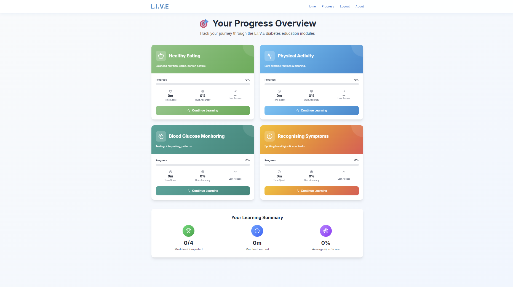

# 🎓 L.I.V.E – Learn. Improve. Visualise. Empower

**Interactive Educational Platform on Diabetes Management through Gamification**

Developed as part of the MSc Computer Science project at the **University of Lincoln**, L.I.V.E aims to provide an engaging and educational experience for users to better manage diabetes using gamification principles.

---

## 🔹 Features

* Gamified learning modules to educate users about diabetes management.
* User authentication with secure login and guest access.
* Audit logging for tracking user interactions.
* Scalable full-stack architecture using React (Vite) frontend and FastAPI backend.
* Containerized deployment with Docker and CI/CD automation to Microsoft Azure.

---

## 🚀 Local Setup

### Prerequisites

* **Node.js v20.12.2**
* **PostgreSQL** (local or cloud, e.g., NeonDB)
* **Python 3.10+**

### Clone Repository

```bash
git clone -b release git@github.com:RiverO2442/L.I.V.E.git
cd L.I.V.E
```

### Backend Setup

```bash
cd BE
npm install
npm start
```

### Frontend Setup

```bash
cd FE
npm install --legacy-peer-deps
npm run dev
```

The application will be accessible at [http://localhost:5173](http://localhost:5173).

---

## 🌐 Live Deployment
- Previously deployed at: [https://4.250.104.28/login](https://4.250.104.28/login)
> ⚠️ Note: The server subscription is currently inactive, so the live site is temporarily unavailable.
---



## 🛠 Technology Stack

* **Frontend:** React, Vite, Tailwind CSS
* **Backend:** FastAPI, Python
* **Database:** MongoDB (user/content management)
* **DevOps:** Docker, GitHub Actions, Microsoft Azure

---

## 📂 Project Structure

```
L.I.V.E/
├─ BE/        # Backend source code
├─ FE/        # Frontend source code
├─ README.md  # Project documentation
```

---

## 🤝 Contributing

Contributions are welcome! Please fork the repository and create a pull request for review.

---

## 📄 License

This project is open-source and available under the MIT License.

